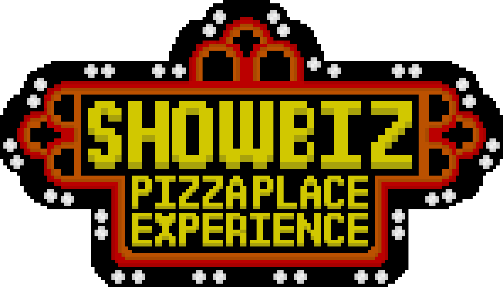

A fan-made Minecraft mod focused around [The Rock-afire Explosion](https://www.youtube.com/watch?v=8SeSavNd9_c&list=PLB8A625C54121DA04)

Minecraft lets you combine tons of different mods and situations, making this simulator able to be enjoyed in VR via mods like ViveCraft, and with friends via multiplayer.

Unlike a proper simulation engine, this mod is pretty simple by design.

### `⚠️ This project is in VERY early development ⚠️`

## Components
- [Showbiz-Show-Format](https://github.com/FlooferLand/Showbiz-Show-Format) _(todo: link a maven repo link here once its up)_
  - Reads show data from a custom bin format created by passing `rshow` files into [RshowMiddleware](https://github.com/FlooferLand/RshowMiddleware)
  - Additionally allows for compression, which the `rshow` format doesn't.

## Building
1. Run `.\gradlew build`
2. Run `.\gradlew genSources` and select the generated mapping
   - Optionally bookmark `External Libraries/net.minecraft:minecraft-merged` for convenience
- Add `DATAGEN=1` as an environment variable to your Data Generation profile
